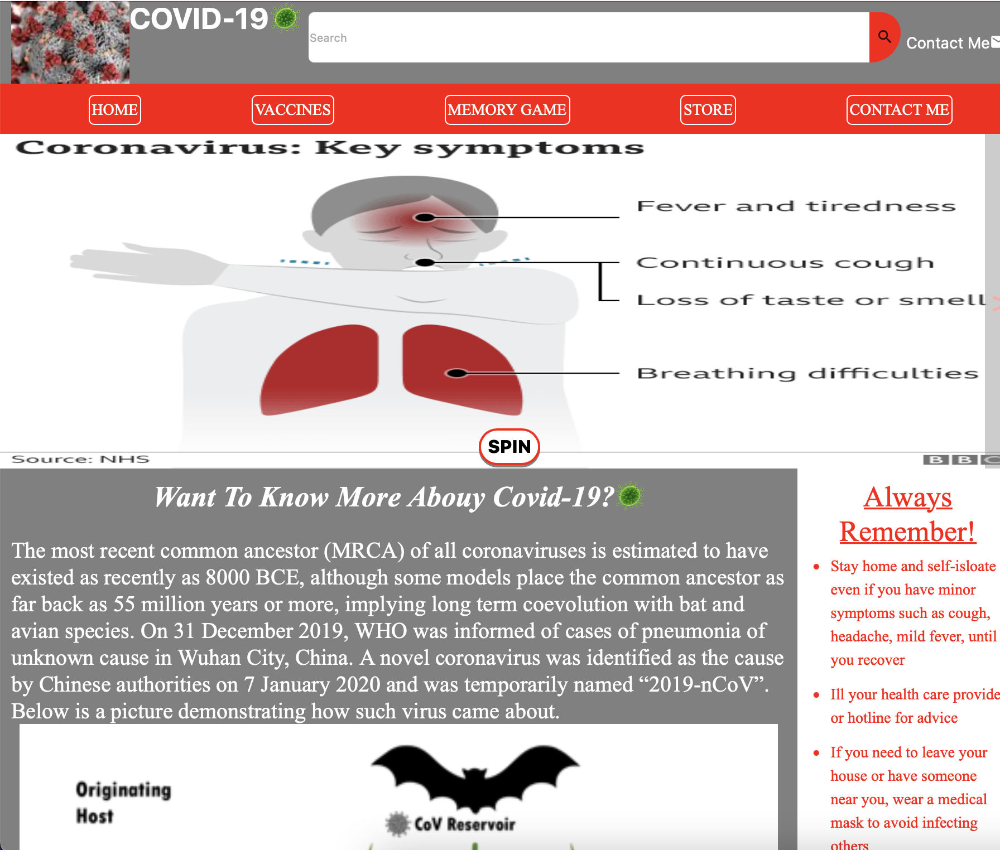

# FinalWeb
## walters-skn.github.io
### The website Structure
- Home
- Vaccines
- Memory Game
- Store
- Contact Me

<p align="center">
  
</p>

### Git commands I used:
```
git clone https://github.com/username/repository-name
git add .
git commit -m "description"
git push
```